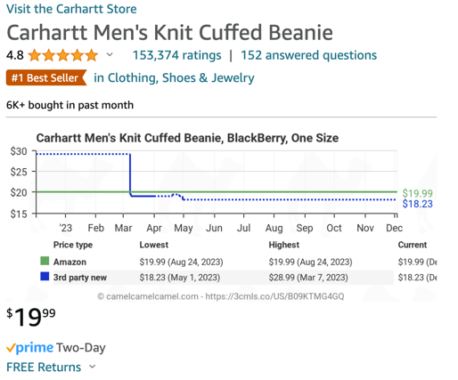
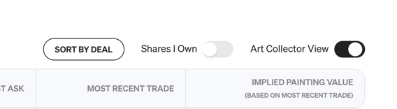

# Tampermonkey Scripts

This repository contains addon scripts, that can be injected in to websites by [Tampermonkey](https://www.tampermonkey.net/).

To use these tools, install the extension on your favorite browser:
- [Chrome](https://chrome.google.com/webstore/detail/dhdgffkkebhmkfjojejmpbldmpobfkfo)
- [Microsoft Edge](https://microsoftedge.microsoft.com/addons/detail/iikmkjmpaadaobahmlepeloendndfphd) 
- [Firefox](https://addons.mozilla.org/en-US/firefox/addon/tampermonkey/)
- [Safari](https://apps.apple.com/us/app/tampermonkey/id1482490089)
- [Opera Next](https://addons.opera.com/en/extensions/details/tampermonkey-beta/)

## Scripts

To install a script, click the `Install` link below.

### Rachio Reorder Calendar

[View Source](rachio-reorder-calendar.user.js) |
[Install](https://raw.githubusercontent.com/duanemay/tampermonkey-scripts/main/rachio-reorder-calendar.user.js)

This script will reorder the calendar on the Rachio Sprinkler Controller website, 
so that it appears in chronological order, instead of in random order.

### Remove Gmail Ads

[View Source](gmail-ads.user.js) |
[Install](https://raw.githubusercontent.com/duanemay/tampermonkey-scripts/main/gmail-ads.user.js)

This script will skip over the ad rows from the Gmail website.

### Amazon CamelCamelCamel Price History

[View Source](amazon-camelcamelcamel-price-chart.user.js) |
[Install](https://raw.githubusercontent.com/duanemay/tampermonkey-scripts/main/amazon-camelcamelcamel-price-chart.user.js)

This script will show the price history of an item on Amazon, when viewing the item on Amazon.

### Masterworks Reorder Art Collectors View

[View Source](masterworks-reorder.user.js) |
[Install](https://raw.githubusercontent.com/duanemay/tampermonkey-scripts/main/masterworks-reorder.user.js)

This script will add a button that when pressed will reorder the art 
shown in the collectors view on the Masterworks website,
so that it appears in order of the best "deal."  
Where a deal is defined by 1 minus the current implied value of the art, 
divided by the current Appraised (or Offering) value of the art.
Note: it will only reorder the art that is currently visible on the page.

### Edgenuity Auto-Advance

[View Source](edgenuity.user.js) |
[Install](https://raw.githubusercontent.com/duanemay/tampermonkey-scripts/edgenuity/edgenuity.user.js)

This script will automatically advance to the next page in an Edgenuity course, when the current video is completed.
